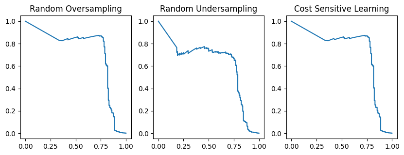
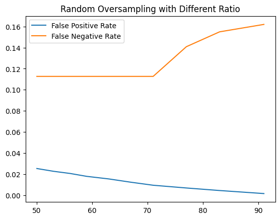
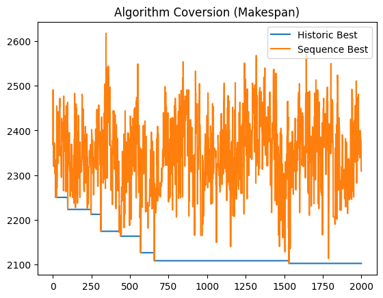

# Manufacturing Data Science Assignment 4
## Question 1: Data Imbalance Problem
在 Kaggle 開放數據中包含了一個 信 用 卡 詐 欺 數 據 (Credit Card Fraud Detection ，
https://www.kaggle.com/datasets/mlg-ulb/creditcardfraud)，信用卡公司能夠識別詐欺性信用卡交
易非常重要，這樣客戶就不會因未購買的商品而被收取費用。此資料集包含歐洲持卡人 2013
年 9 月透過信用卡進行的交易。該資料集顯示了兩天內發生的交易，其中 284,807 筆交易
中有 492 筆詐欺。資料集高度不平衡，正類（詐欺）佔所有交易的 0.172%。試著參考網路
資源學習並撰寫程式，使用此數據回答下列問題。

請閱讀此文章，”Best techniques and metrics for Imbalanced Dataset”
https://www.kaggle.com/code/marcinrutecki/best-techniques-and-metrics-for-imbalanced-dataset/notebook.

### (a) 試在該數據分析流程中加入數據平衡的步驟，使用三種方法來進行數據平衡(e.g. 使用上抽樣、下抽樣或是代價敏感學習等)。
首先列出在這篇文章中已被驗證的幾個資料集特性：
* huge outliers
* higly skeved data
* a lot of outliers

進行 EDA 與 Data Preprocessing 以後，使用 random oversampling、undersampling 以及 cost-sensitive learning 進行數據平衡，並且使用 Logistic Regression 模型，並且用 AUPRC 進行評估。

```python
Random Oversampling: 0.726547633593626
Random Undersampling: 0.6201800108020427
Cost Sensitive Learning - Logistic: 0.7265260971538194
```


### (b) 承(a)，試比較三種方法？建議選用哪種方法最為合適？為什麼？

以 AUPRC 來看，上抽樣與代價敏感學習效果差不多，但下抽樣就表現的比較差，主要原因應該是懸殊的分類比例導致下抽樣使得樣本過少。

### (c) 對於數據多數群與少數群的比例應當調整至多少？為什麼？試透過調整生成比率 (i.e. 敏感度分析)來看模型分類結果。(提示：將敏感度分析以繪圖呈現兩條曲線，x 軸為不同生成比例、y 軸為偽陽性率(false positive rate)與偽陰性率(false negative rate))

同樣使用 Logistics Regression 模型，並且測試 minor / samples 從 Major 50%~90% 的生成比率繪製圖表。由圖可見 70 % 的時候可以獲得最低的偽陰性，而同時偽陽性又不至太高。



### (d) 試說明特徵挑選步驟應於數據平衡前或後，這對預測結果有何影響？
* 特徵挑選應該在數據平衡前進行，因為特徵工程是專注在質，而數據平衡專注在量，而量的選擇應該要基於質，畢竟許多方法包含代價敏感分析都會需要在預測中逐步數據平衡，特徵工程應該要先做好才能達到最佳預測效果。
### (e) 就您觀點簡短敘述(不超過 200 字)，您覺得這文章”Best techniques and metrics for Imbalanced Dataset”還有什麼需要補充或改進的地方。
* 沒有特別就此份 Data 應該如何調整生成比率做測試，觀察如何造成影響。
* 此篇目的是要評斷各種數據平衡的方式，但 Training Model 卻只有使用隨機，沒有考慮隨機森林是否能夠對這份資料集做出很好的預測，因此各種數據平衡的優劣可能會被錯誤評斷。

## Question 2: Metaheuristic Algorithm
試求解工單式生產排程(job shop scheduling)問題，最小化最大完工時間(makespan)。資料來源
參考 Taillard's 排程案例
(http://mistic.heig-vd.ch/taillard/problemes.dir/ordonnancement.dir/ordonnancement.html) ， 其
tai20_15 包含 20 個工件(job)與 15 個機台(machine)，每個工件有 15 個加工作業(operation)，
工件加工時間與工件加工機台順序如下表所示。
### (a) 試以基因演算法求解並說明其設計細節，包含染色體編碼、交配、突變、選擇、與相關參數(e.g. 母體大小、交配率、突變率等)；
* 染色體編碼：為排序編碼，每一條染色體包含 N * M 個基因，為加工序列的機器編號。
* 交配方式：根據交配率，採用隨機兩點擷取一段基因互換的方式。
* 突變：使用突變率隨機交換順序，即變動加工順序。 
* 選擇：採用輪盤法 (Roulette wheel) 的選擇機制，即根據適應值作為被隨機選擇到的機率。
* 相關參數預設值：母體大小 30、交配率 0.8、突變率 0.2、迭代次數 2000。
### (b) 若交配突變產生不可行的染色體，試建議染色體修復方法(repair)。
理論上每個工件在染色體出現的次數為 10 次，因此若是染色體內的工件出現次數會小於 10 或大於 10 即為不可行的排程解，因此需要將這些少於 10 的工件取代多於 10 的工件。
### (c) 撰寫相關程式求解，並呈現出最佳解與求解時間：

```python
optimal sequence [1, 6, 5, 2, 10, 5, 15, 12, 2, 4, 5, 5, 4, 6, 0, 14, 10, 12, 14, 7, 2, 16, 6, 6, 12, 2, 15, 9, 17, 11, 9, 14, 5, 11, 17, 2, 3, 17, 12, 8, 10, 14, 3, 9, 0, 17, 6, 3, 1, 17, 14, 5, 18, 15, 9, 9, 10, 11, 11, 13, 1, 4, 10, 8, 1, 4, 15, 12, 16, 8, 16, 5, 18, 15, 16, 3, 3, 6, 1, 12, 12, 8, 9, 2, 14, 18, 17, 13, 17, 18, 14, 4, 0, 7, 1, 17, 3, 6, 9, 1, 1, 13, 4, 2, 7, 13, 13, 4, 1, 14, 5, 17, 9, 10, 12, 6, 0, 0, 0, 12, 16, 18, 11, 16, 10, 13, 5, 4, 13, 12, 13, 11, 7, 7, 15, 7, 14, 9, 10, 1, 18, 17, 0, 15, 5, 16, 11, 1, 16, 7, 10, 6, 2, 14, 3, 8, 17, 0, 13, 7, 13, 4, 14, 0, 5, 15, 18, 16, 2, 13, 10, 1, 1, 15, 4, 12, 5, 15, 8, 3, 9, 8, 17, 7, 4, 2, 18, 12, 7, 8, 15, 18, 16, 8, 5, 0, 9, 9, 2, 1, 18, 6, 15, 11, 17, 8, 6, 16, 11, 11, 16, 0, 18, 10, 8, 3, 18, 10, 16, 7, 14, 10, 7, 2, 12, 11, 8, 4, 13, 0, 6, 0, 7, 5, 0, 3, 18, 10, 2, 4, 18, 9, 6, 17, 12, 2, 8, 7, 4, 15, 11, 6, 8, 1, 9, 3, 14, 8, 14, 6, 12, 2, 11, 3, 13, 15, 16, 3, 7, 4, 14, 3, 18, 16, 3, 13, 11, 5, 15, 9, 17, 0, 11, 13, 10]
optimal value:2102.000000
the elapsed time:62.25211000442505
```

### (d) 試繪製演算法收斂圖(e.g. x 軸為迭代、y 軸為適應值)，包含歷史迭代中最佳適應值與目前迭代回合的最佳適應值兩條曲線。

(參考文獻 Taillard, E. (1993). “Benchmarks for basic scheduling problems,” European Journal of Operational Research, 64(2), 278-285.)

(Hint: https://github.com/PO-LAB/Operations-Research-Applications ，基因演算法於生產排程 1 或基因演算法於生產排程 2)

